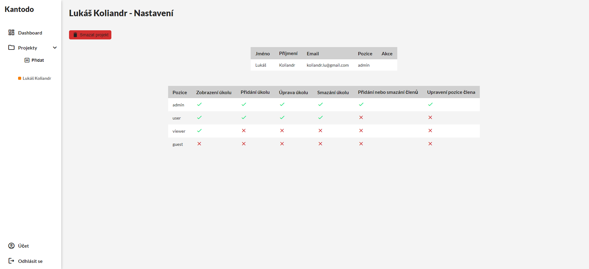

# Kantodo - maturitní práce

- "jednoduchá" webová todo aplikace
- aplikace není určena pro mobily

## Požadavky na server

- \>= PHP 7.1
- extension `gmp`

## Screenshots

## Instalace

1. `composer install`
2. zkompilujte sass soubory do složky styles
    - `sass "sass/main.scss" "styles/main.min.css" --style compressed`
    - `sass "sass/pages/NAZEV.scss" "styles/NAZEV.min.css" --style compressed`
